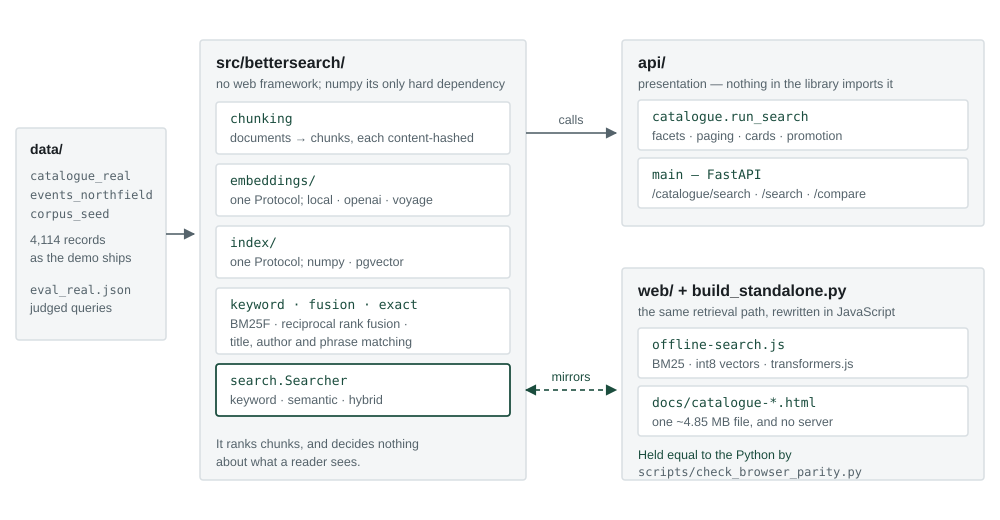
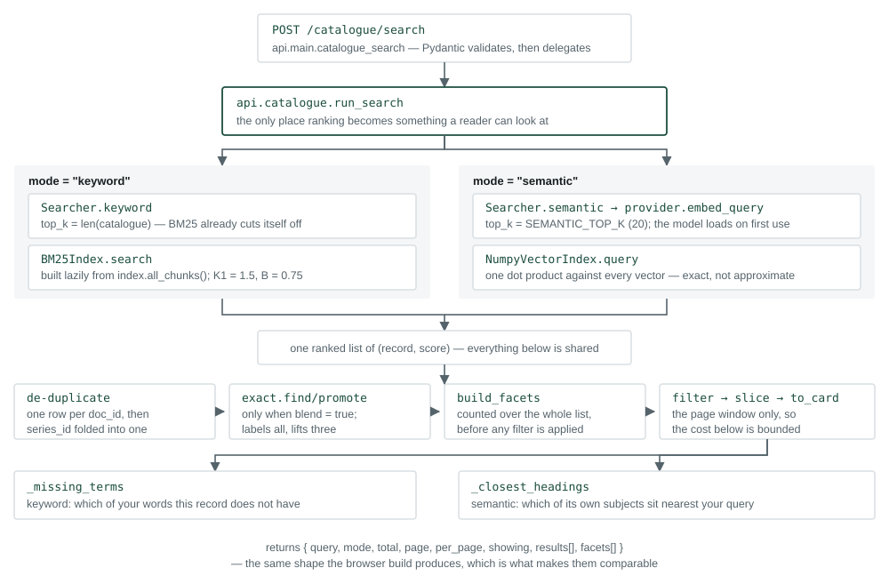

# BetterSearch — technical architecture

A semantic search prototype over a library catalogue: 4,114 records, searchable
by meaning rather than by the words a reader happens to have typed. It ships in
two shapes — a Python service, and a single HTML file that runs the whole thing
in a browser with no server behind it.

This document describes what the system is made of. **Part I** is the shape of
it, and assumes engineering literacy but no familiarity with this repository.
**Part II** is the component-by-component detail, and assumes you are about to
change something.

Everything here is named by real path and real symbol, so it can be checked
against the code rather than believed. It describes structure only; the measured
results that justify particular choices live in `README.md` and in the module
docstrings, next to the code they argue for, where they cannot drift out of date
unnoticed.

---

# Part I — The high-level view

## 1. What it does

A reader types a phrase. The system returns catalogue records ordered by how
well they answer it, with facets to narrow by, and a line on each card saying
why that record is there. It can do this two ways: by matching the words
themselves, or by matching meaning — so that *learning to be present* can return
a book about attention whose record never uses either word.

Retrieval is the whole product. There is no generation step, no chat, and
nothing is written back into a record. Where the system has used a language
model to make thin records findable, that text is a bridge for retrieval only
and is never shown to a reader as though it were catalogue truth.

## 2. The shape: three trees



| Tree | What it is | What it may import |
|---|---|---|
| `src/bettersearch/` | the library: chunking, embedding, indexing, ranking | nothing above it |
| `api/` | presentation — turns a ranking into a page of cards | the library |
| `web/` | the same retrieval path, written again in JavaScript | nothing; it is a port |
| `scripts/` | build, measure, tune, render | anything |

The dependency arrows only point one way. The library has no idea a web
framework exists; `numpy` is its only hard dependency, and everything else —
`sentence-transformers`, `fastapi`, `anthropic`, `psycopg` — is an optional
extra installed per deployment. Nothing in `src/bettersearch/` imports `api/`,
which is what makes the library droppable into a Django or DRF project without
carrying a second web framework in with it.

`web/` is the unusual one. It is not a client that calls the API; it is a
**re-implementation** of the retrieval path in JavaScript, so the same search can
run with no server at all. Two implementations of one algorithm is a liability,
and it is managed rather than hoped about: `scripts/check_browser_parity.py`
runs both sides over the same queries and reports where they disagree.

## 3. Two deployment shapes, one source

**The server.** `uvicorn api.main:app` — FastAPI over the library, with the
index either as local numpy arrays or as a `pgvector` table in Postgres. This is
the shape that scales, and the one a real integration would use.

**The standalone file.** `scripts/build_standalone.py` inlines the corpus, its
vectors and the entire search engine into one ~6.96 MB HTML file. Opening it
runs a real semantic search with no server, no API key and no network after the
model has been fetched once. This is the shape you can email to someone.

Both run the same encoder. The browser stores its corpus vectors as int8 rather
than float32, which is the one remaining difference and is measured rather than
assumed. The page shipped a smaller model until September 2026, on an argument
about download size that turned out to be wrong about the download size; the
cost was a demo that behaved differently from the service it was demonstrating.

## 4. The four ideas the design rests on

**Chunk, then embed.** A document is split into overlapping passages before
embedding, because an embedding of a whole document is an average, and averages
retrieve badly. Each chunk carries its parent `doc_id`, so results can be
collapsed back to one row per record at the point of display.

**The index is the contract.** Every index stores the `model_id` it was built
with, and that id is checked on read *and* on write. Change the encoder and the
index refuses to answer rather than quietly scoring today's query against
yesterday's vectors — the failure mode that produces plausible, wrong results
and no error. `scripts/build_standalone.py` enforces the same rule at build
time, refusing to bake a page whose model disagrees with its index.

**Retrieval and presentation are separate.** `Searcher` ranks chunks and decides
nothing about what a reader sees. Everything that makes a page — collapsing
chunks to records, folding an event series into one card, counting facets,
paging, deciding which explanation to attach — lives in `api/catalogue.py`.
The split matters because presentation changes constantly and retrieval should
not have to move each time it does.

**The browser port is held true by a check, not by discipline.** Two
implementations drift. `check_browser_parity.py` drives the built page in a real
headless browser, runs the same queries through the Python API, and compares
rankings, explanations and promotion labels record by record. Exact agreement is
the bar for the model-free parts; the parts that go through a quantised model
are expected to differ slightly, and the check reports how much rather than
pretending they don't.

---

# Part II — The low-level view

## 5. A request, end to end



`POST /catalogue/search` → `api.main.catalogue_search` (Pydantic validates the
body) → `api.catalogue.run_search`, which does the following in order:

1. **Rank.** `mode="semantic"` → `Searcher.semantic(top_k=SEMANTIC_TOP_K)`,
   which embeds the query and hands it to `NumpyVectorIndex.query` — one dot
   product against every vector, exact rather than approximate.
   `mode="keyword"` → `Searcher.keyword(top_k=len(catalogue))` at full depth,
   because BM25 cuts itself off by returning only positive scores.
2. **Collapse to records.** De-duplicate by `doc_id`, drop hits no longer in the
   catalogue, and fold repeated `series_id` occurrences into their best-ranked
   instance, incrementing a `repeats` count.
3. **Promote** (only when `blend=True`): `exact.find` locates records the reader
   arguably *named*; `exact.promote` labels every one of them and lifts the
   first `MAX_PROMOTED` to the top.
4. **Facet.** `build_facets` counts over the whole ranked list *before* any
   filter is applied, so the counts describe what is available rather than what
   survived the last click.
5. **Filter and page.** `matches_filters` (OR within a facet, AND across
   facets), then slice the page window, then `to_card` each surviving record.
6. **Explain.** Keyword mode attaches `missing_terms` — which of your words this
   record does not contain. Semantic mode attaches `closest_headings` — which of
   the record's own subject headings sit nearest your query. Both run on the
   page window only, so their cost is bounded by `per_page` rather than by the
   corpus.

The response is `{query, mode, total, page, per_page, showing, results[],
facets[]}`. The browser build produces the identical shape, which is what makes
the two comparable at all.

Hybrid mode (`reciprocal_rank_fusion` over both lanes, each retrieved at four
times the requested depth) exists on `/search` and `/compare` but is deliberately
**not** reachable from the catalogue page.

## 6. Component summary

### The library — `src/bettersearch/`

| Module | What it does | Names and values that matter |
|---|---|---|
| `types.py` | the shared vocabulary; no behaviour | `Document`, `Chunk`, `EmbeddedChunk`, `ScoredChunk`, `IndexStats`, and the two fatal errors `ModelMismatchError`, `EmptyIndexError` |
| `config.py` | one frozen `Settings`, built entirely from the environment | `load_settings()`; every knob is a `BETTERSEARCH_*` variable (§9) |
| `chunking.py` | paragraph-aware splitting with overlap | `chunk_document`, `chunk_documents`, `content_hash` (sha256, first 16 hex); ~450-token target, 60-token overlap, tokens estimated at 1.3 per word; oversized paragraphs split on sentences |
| `keyword.py` | the BM25F baseline, hand-rolled | `tokenize` (56-word stopword list), `BM25Index`; `K1 = 1.5`, `B = 0.75`, `TITLE_WEIGHT = 1.0`. Returns only positively-scoring documents — a query sharing no terms returns nothing at all |
| `fusion.py` | reciprocal rank fusion | `reciprocal_rank_fusion`, `DEFAULT_K = 60`. Uses list position only, never a raw score, so two incomparable scales can be combined |
| `exact.py` | the one signal neither ranking lane can see: word order | `find`, `promote`, `ExactMatch`; `PHRASE_TOKENS = 3`, `MAX_PROMOTED = 3`. Pure string work over title and author — no model, no vectors. Labelling and lifting are separate jobs; the cap governs only the second |
| `search.py` | the public entry point | `Searcher.keyword / .semantic / .hybrid / .search / .compare / .stats`; `MODES = ("keyword","semantic","hybrid")`. Each hybrid arm retrieves 4× the requested depth before fusing |
| `ingest.py` | documents → chunks → vectors → index | `load_corpus` (merges several files; a repeated `doc_id` raises), `ingest_documents`, `ingest_corpus`, `IngestReport`; embeds in batches of 64 |
| `evaluate.py` | retrieval metrics at document level | `recall_at_k`, `reciprocal_rank`, `ndcg_at_k`, `evaluate_mode`, `evaluate_all`, `per_query_breakdown` |
| `cli.py` | `bettersearch` on the command line | `ingest`, `search`, `compare`, `evaluate`, `enrich`, `stats` |

### Embeddings — `src/bettersearch/embeddings/`

One `Protocol`, three implementations. Anything with `model_id`, `dimensions`,
`max_input_tokens`, `embed_documents` and `embed_query` is a provider.

| Module | Provider | Notes |
|---|---|---|
| `base.py` | the `EmbeddingProvider` Protocol | plus `l2_normalize`, so a dot product *is* cosine similarity everywhere downstream |
| `local.py` | sentence-transformers, the default | `BAAI/bge-base-en-v1.5` (768d). `SUGGESTED_MODELS` carries seven encoders with their input limits, dimensions and download sizes |
| `openai_.py` | `text-embedding-3-small` | 8,191-token limit; needs `OPENAI_API_KEY`; re-sorts the response by index because the API does not promise order |
| `voyage.py` | `voyage-3.5-lite` | 32,000-token limit; asymmetric — documents and queries are encoded with different `input_type` |

Both hosted providers support Matryoshka truncation, which is why
`embedding_dimensions` is a setting rather than a property of the model.

### Index — `src/bettersearch/index/`

One `Protocol` — `upsert`, `query`, `existing_hashes`, `all_chunks`, `stats`,
`clear` — and two backends.

| Module | Backend | Storage |
|---|---|---|
| `numpy_index.py` | `numpy`, the default | two files: `<path>.npz` (float32 vectors) and `<path>.json` (chunks, `model_id`, `dimensions`). Brute-force exact cosine over every row |
| `pgvector_index.py` | `pgvector` | one table `bettersearch_chunk`: a `halfvec` embedding column with an HNSW cosine index, plus a generated `tsvector` with a GIN index for full-text |

Both raise `ModelMismatchError` rather than answer with the wrong encoder's
vectors, and `EmptyIndexError` rather than return an empty list that looks like
"no results".

### Enrichment — `src/bettersearch/enrichment/`

Thin catalogue records — a title, an author, a couple of subject headings — give
an encoder almost nothing to work with. This subsystem asks a language model for
bridging vocabulary and stores it beside the record. **The generated text is
used only to make a record findable. It is never displayed as catalogue truth.**

| Module | What it does |
|---|---|
| `schema.py` | `Enrichment`, the strict JSON schema the model must return, `PROMPT_VERSION = "v1"`, and `source_hash` |
| `prompt.py` | the system prompt, which branches on whether the model recognises the work — a known book is described from knowledge, an unknown one only from its own record |
| `client.py` | the Anthropic client: single calls, batch submission, and a `preflight` that proves one item works before paying for a batch |
| `store.py` | append-only JSONL, keyed on `(item_id, prompt_version, model, source_hash)` — so nothing is ever paid for twice and a changed record re-enriches by itself |
| `pipeline.py` | resumable orchestration; an in-flight batch id is written to a sidecar so a killed process reattaches instead of losing paid work |

### Presentation — `api/`

| Module | What it does |
|---|---|
| `main.py` | the FastAPI app. Holds no retrieval logic: seven routes, a `{status, data}` envelope, and two exception handlers that turn `EmptyIndexError` and `ModelMismatchError` into HTTP 409 rather than a 500 |
| `catalogue.py` | everything that makes a page. `run_search` (§5), `build_facets`, `matches_filters`, `to_card`, `_missing_terms`, `_closest_headings`, `load_catalogue`, `load_meta`. `SEMANTIC_TOP_K = 20`, `EXPLAIN_HEADINGS = 2` |

`_closest_headings` embeds each distinct subject heading on the current page and
caches the vectors in a `WeakKeyDictionary` **keyed on the provider object**, so
the cache dies with the provider it belongs to and cannot outlive a model swap.

### Browser — `web/`

| File | What it does |
|---|---|
| `offline-search.js` | the port. `tokenize`, `buildBM25`, `keywordRank`, `semanticRank`, `missingTerms`, `closestHeadings`, `findExact`, `promoteExact`, `collapse`, `buildFacets`, `search`. Exposes one global, `window.OFFLINE` |
| `catalogue.html` | the catalogue page. Talks to `/catalogue/search` when served, and to `window.OFFLINE` when that global exists — the same page source is both the served app and the standalone file |
| `index.html` | a developer comparison view: all three modes side by side, scored. For working on retrieval, not for showing anyone |

The page loads `@huggingface/transformers` from a CDN on the **first semantic
search**, not at page load, and embeds the query with CLS pooling and L2
normalisation to match how the server-side model was trained. Corpus vectors are
not re-embedded in the browser; they are lifted from the index at build time,
quantised to int8 with a per-vector scale, and base64'd into the file.

### Scripts — `scripts/`

Eighteen standalone programs, none imported by anything.

| Group | Scripts | Purpose |
|---|---|---|
| Fetch and build data | `fetch_openlibrary`, `fetch_wikipedia`, `build_catalogue`, `build_events`, `synthesise_catalogue`, `build_eval_set` | assemble the corpora and the judged query set |
| Build artefacts | `build_standalone` | inline corpus, vectors and engine into one HTML file |
| Check | `check_corpus`, `check_events`, `check_browser_parity`, `check_answerability`, `check_query_routing` | assert properties that tests cannot — corpus coverage, browser/Python agreement, whether a signal exists at all |
| Tune | `tune_title_weight`, `tune_cutoff`, `tune_confidence_break`, `compare_arms` | sweeps that chose the constants above, and in several cases argued against shipping a change |
| Present | `render_pdf`, `capture_screenshots` | this PDF, and the README screenshots |

## 7. Data and persistence


**Corpora** (`data/`, read-only inputs, all committed). Every corpus is
`{name, description, presets, documents[]}`. The shipped demo is
`catalogue_real.json` (4,000 real bibliographic records from Open Library) plus
`events_northfield.json` (114 invented events), sharing one record schema so
both collections can be searched and faceted together.

> The bibliographic data is real. Availability, copies, branch, format and cover
> colour are invented, and the events programme is invented entirely. None of it
> should be quoted as describing a real library.

**The index** is a file pair, rewritten in full on every `upsert`:
`<path>.npz` holds L2-normalised float32 vectors, one row per chunk;
`<path>.json` holds the chunks themselves plus the `model_id` and dimensions
that make up the contract. The BM25 index is not persisted — it is rebuilt from
`all_chunks()` on first keyword search, lazily, so a semantic-only process never
pays for it.

**Judgements** (`eval_real.json`, `eval_real_judgements.json`) are TREC-style
pooled relevance labels, kept so that any future change can be measured against
the same bar rather than against a new one.

**Enrichment** is append-only JSONL with an in-flight sidecar, as above.

`.bettersearch/` is gitignored. The index is built at deploy time, not committed
— which is why the CI workflow embeds the corpus itself before building a page.

## 8. Interfaces and contracts

**The two Protocols** are the extension points. Implement `EmbeddingProvider` to
add an encoder; implement `VectorIndex` to add a backend. Neither requires
touching `Searcher`.

**HTTP.**

| Method | Path | Body | Returns |
|---|---|---|---|
| `GET` | `/health` | — | provider, modes, index stats |
| `POST` | `/search` | `query`, `mode`, `top_k` | scored chunks |
| `POST` | `/compare` | `query`, `top_k` | all three modes at once |
| `POST` | `/catalogue/search` | `query`, `mode`, `page`, `per_page`, `filters`, `blend` | cards, facets, paging |
| `GET` | `/catalogue/meta` | — | presets and description, read from the corpus |
| `GET` | `/catalogue`, `/` | — | the two HTML pages |

Note that `/catalogue/search` accepts only `keyword` and `semantic` — hybrid is
reachable from the developer routes only.

**The baked globals.** `build_standalone.py` writes five values into the page so
the browser runs the same constants as the server rather than a second copy that
can drift:

```
window.__SEMANTIC_TOP_K__    window.__EXPLAIN_HEADINGS__    window.__PHRASE_TOKENS__
window.__MAX_PROMOTED__      window.__INTERACTION__
```

`__INTERACTION__` is the only one that changes behaviour rather than a threshold:
`"toggle"` keeps the keyword/meaning switch, `"blended"` removes it and routes
every search through meaning with named records lifted. It is why two pages are
built from one source.

## 9. Configuration

Everything is an environment variable; there is no config file.

| Variable | Default | Effect |
|---|---|---|
| `BETTERSEARCH_EMBEDDING_PROVIDER` | `local` | `local` · `openai` · `voyage` |
| `BETTERSEARCH_INDEX` | `numpy` | `numpy` · `pgvector` |
| `BETTERSEARCH_INDEX_PATH` | `.bettersearch/index` | where the file pair lives |
| `BETTERSEARCH_DATABASE_URL` | — | falls back to `DATABASE_URL` |
| `BETTERSEARCH_CHUNK_TOKENS` | `450` | target chunk size |
| `BETTERSEARCH_CHUNK_OVERLAP` | `60` | overlap between chunks |
| `BETTERSEARCH_EMBEDDING_DIMENSIONS` | `512` | Matryoshka width, hosted providers only |
| `BETTERSEARCH_LOCAL_MODEL` | `BAAI/bge-base-en-v1.5` | the local encoder |
| `BETTERSEARCH_LOCAL_TRUST_REMOTE_CODE` | `false` | required by some long-context encoders; runs code from the model repo, so it is off by default |
| `BETTERSEARCH_CATALOGUE` | `data/catalogue_library.json` | comma-separated corpora to serve |
| `BETTERSEARCH_TOP_K` | `20` | semantic depth for the catalogue page |

`OPENAI_API_KEY`, `VOYAGE_API_KEY` and `ANTHROPIC_API_KEY` are read only by the
component that needs them. **Search needs no key at all** — only enrichment and
the hosted embedding providers do.

## 10. Tests and CI

`pytest -q`, five test files and a `conftest.py`, and the suite needs no model,
no network and no API key:
`conftest.py` provides a `FakeEmbeddingProvider` that derives deterministic
vectors from a SHA-256 hash. That is a deliberate limit — **these tests prove
the plumbing, not the retrieval quality.** Quality is measured separately, by
the scripts in §6, against judged queries.

| File | Covers |
|---|---|
| `test_chunking.py` | splitting, overlap termination, hash stability, ordinal uniqueness |
| `test_index_and_ingest.py` | cosine ordering, the model-mismatch refusal on both read and write, upsert-not-duplicate, incremental re-embedding, colliding doc_ids |
| `test_retrieval.py` | tokenising, BM25 behaviour, fusion, the three metrics, mode dispatch, and that keyword mode never loads the embedding model |
| `test_catalogue_api.py` | the largest file — paging, facets, filters, series collapsing, card fidelity, explanations, and exact-match promotion |
| `test_enrichment.py` | caching, prompt-version invalidation, out-of-order batch matching, and that a dead poller does not lose a paid batch |

**CI** (`.github/workflows/ci.yml`) installs the dev extra and runs the suite on
every push and every pull request, then greps `render.yaml` to assert the deploy
blueprint still builds the index and still installs CPU-only torch.

**Pages** (`.github/workflows/pages.yml`) embeds the corpus on the runner, builds
both standalone pages from that one index, and deploys `docs/`. Because it
re-embeds rather than committing vectors, the published files differ from the
committed ones by a handful of int8 values — floating-point rounding either side
of a quantisation boundary, not a different model.

**One gap worth stating plainly:** there is no JavaScript test suite.
`offline-search.js` is verified only by `check_browser_parity.py`, and that
script is not wired into either workflow — it is run by hand. A change to the
browser port can therefore reach `main` without anything having compared it to
the Python.

---

## Appendix — file map

```
src/bettersearch/        the library — framework-free, numpy its only hard dependency
  types.py               Document, Chunk, ScoredChunk, the two fatal errors
  config.py              Settings, from the environment
  chunking.py            paragraph splitting, overlap, content hashing
  keyword.py             BM25F
  fusion.py              reciprocal rank fusion
  exact.py               title / author / phrase matching and promotion
  search.py              Searcher — the public entry point
  ingest.py              documents -> chunks -> vectors -> index
  evaluate.py            Recall@5, MRR@10, nDCG@10
  cli.py                 the bettersearch command
  embeddings/            EmbeddingProvider + local / openai / voyage
  index/                 VectorIndex + numpy / pgvector
  enrichment/            schema, prompt, client, store, pipeline

api/
  main.py                FastAPI — seven routes, no retrieval logic
  catalogue.py           facets, paging, cards, promotion, explanations

web/
  offline-search.js      the retrieval path, ported to JavaScript
  catalogue.html         the catalogue page, served or standalone
  index.html             developer comparison view

scripts/                 fetch · build · check · tune · present
data/                    corpora, judged queries, enrichment JSONL
docs/                    the published site, the PDFs, these diagrams
tests/                   pytest; fake providers, no network, no keys
```
